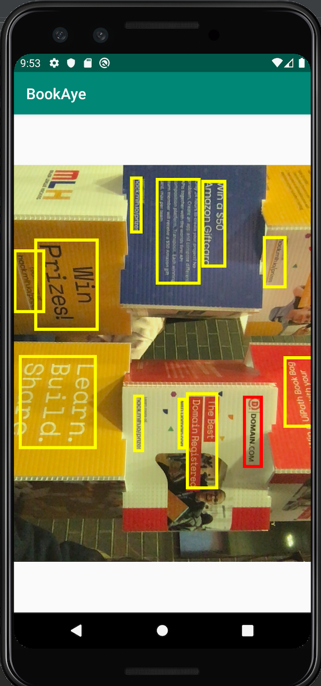

# Inspiration
**Bookshelves are an eyesore**

When we walk into a library and are overwhelmed by the number of books it has, we often struggle locating the exact book we want from a huge, cluttered bookshelf. Although the library's system might give an approximate location such as the section or aisle number, it can't tell you exactly where on the shelf you can find it. Because of this, students waste much of their valuable time manually searching for the books they need for research, studying, or even leisure. **We solve this age-old problem with BookAye.** This app will reduce the time needed to find books from a bookshelf. 

# What it does
BookAye either scans or reads in a picture of a bookshelf. Given the provided book title, the app will highlight where the book locates in the bookshelf picture. It not only recognizes the texts horizontally but also recognizes the texts sideway. When BookAye scans the picture, the app will process the picture and find the closest book title that ties to the given book name. It highlights it to inform where your desired book is. Moreover, it also allows the user to choose a picture from their photo gallery, and the app will work the same way as the previous method. Here is an example when the search word is "domain.com":

# How We built it
We used Android Studio to build the app since we thought it makes the most sense. While building the user interface using basic listeners, we utilized the Google Vision API (ML Kit API) to read the texts from the image for the image processing part. 

## Challenges We ran into
We ran into multiple challenges while starting this project. First of all, the set up of Google Vision API was more difficult than we thought, and we spent quite a bit of time finding the right client API. Thanks to the Google Cloud booth here at BostonHacks, we were able to identify ML Kit for Firebase as the best software to fit our needs. 

## Accomplishments that we are proud of
We are proud to have developed our first Android application, as nobody on the team has done so before. We are also proud to have utilized the Cloud Vision API to perform Optical Character Recognition.

## What We learned
We learned the basics of developing Android applications. We also learned about various computer vision techniques.

## What's next for BookAye
BookAye has lots of room for expansion. The current product uses text-recognition to identify the correct book, but this algorithm could be greatly improved. BookAye will grow to include better book detection using various data points like color, size, and author. To do this, we plan to train the Cloud Vision API using a custom model that specializes in finding books. We also plan to link the application to a book database that allows the user to input the exact book they plan to find, instead of just title keywords.

## Contributors
[Amy Ying](https://github.com/amywhying), [Cindy Luo](https://github.com/cindy1u0), [Oliver Dai](https://github.com/olliezdai13), and [Lucas Segawa](https://github.com/Segawa-NEU)

BostonHacks 2019 Google API Honorable mention
[https://devpost.com/software/bookayeaye](https://devpost.com/software/bookayeaye)
